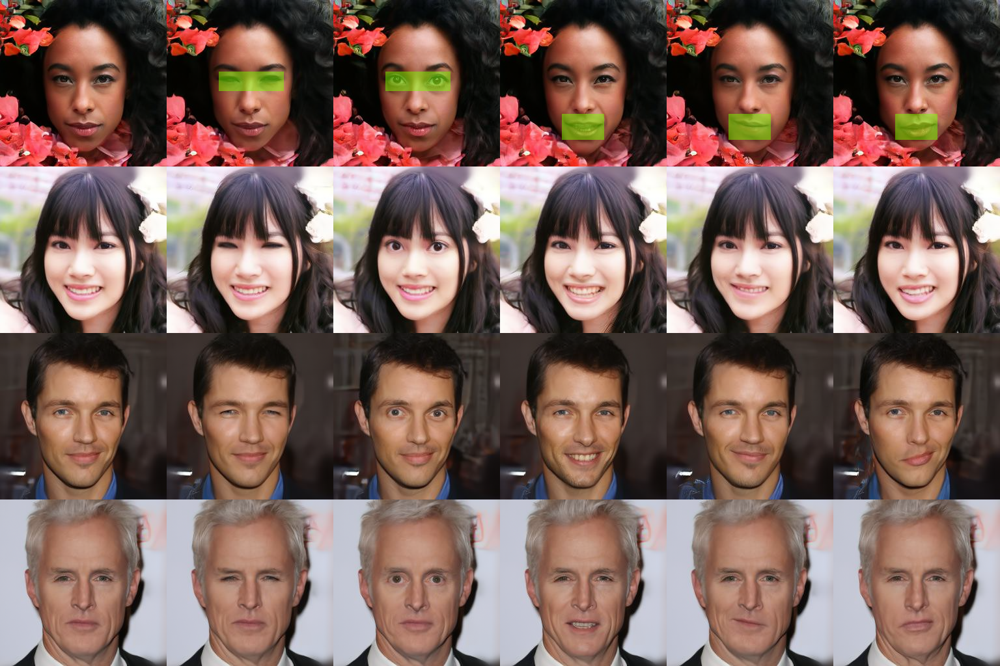

# Unsupervised Region-Based Image Editing of Denoising Diffusion Models



>  ❗️❗️❗️ **News:**
> 
> ✨:1. **Accepted by AAAI 2025**: Our research paper has been accepted by AAAI2025. And latest paper is released at https://arxiv.org/abs/2412.12912 We propose a method to identify semantic attributes in the latent space of pre-trained diffusion models without any further training.

## ⏳ Quick Start

### 1. Installation

You can run the following script to configure the necessary environment:

```
git clone https://github.com/Lzxhh/disentangle-diffusion.git
cd disentangle-diffusion

conda create -n disdiff python=3.9
conda activate disdiff
pip install -r requirements.txt
```

### 

## 📝 Citation

<a href="#top">[Back to top]</a>

If you find our work useful to your research, please cite it as follows:

```
@article{li2024unsupervised,
  title={Unsupervised Region-Based Image Editing of Denoising Diffusion Models},
  author={Li, Zixiang and Song, Yue and Tao, Renshuai and Jia, Xiaohong and Zhao, Yao and Wang, Wei},
  journal={arXiv preprint arXiv:2412.12912},
  year={2024}
}
```
